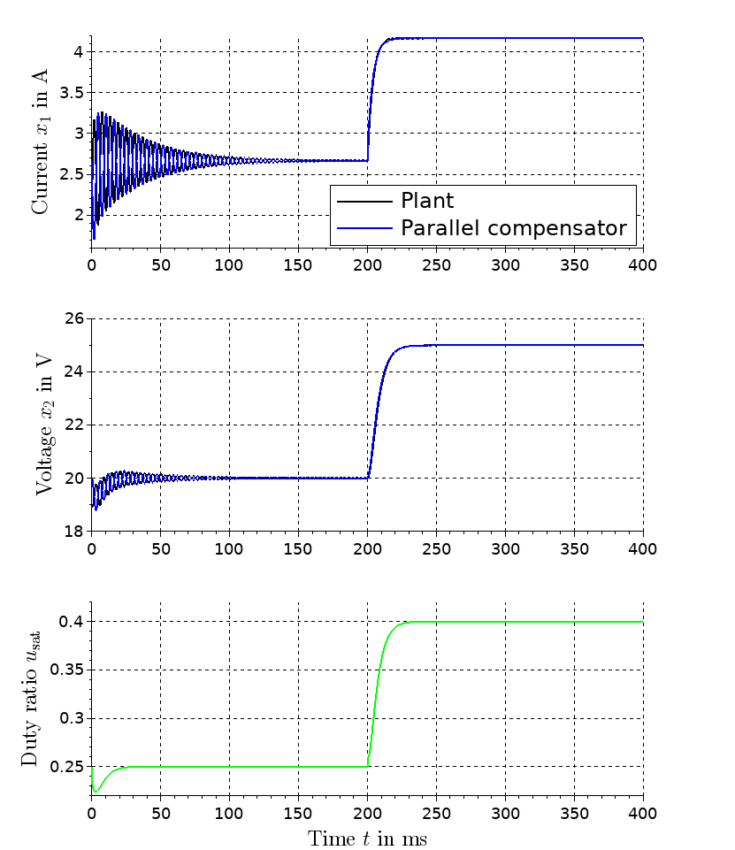

# Parallel Compensator for a Boost Converter

This project contains the [Scilab](https://www.scilab.org/) source file for the simulation of a control loop with a boost converter. Contrary to many other approaches, the voltage output is directly used as a control variable. This results in a non-minimum phase system. The problems arising with this system property are circumvented using a parallel compensator. The intention of this project is to supplement the following conference paper:

Klaus Röbenack, Stafan Palis:  
*On the Control of Non-Minimum Phase Systems Using a Parallel Compensator*.  
[International Conference on System Theory, Control and Computing (ICSTCC)](http://icstcc2019.cs.upt.ro/),   
October 9-11, 2019, Sinaia, Romania

## Prerequisites

To carry out the simulation you need to install the follwoing open source software for numerical computation:

https://www.scilab.org/

## Simulation Results

The numerical simulation combined with the visualisation generates the following graphics showing the trajectories of the controlled system:

 

## References

### Boost Converter Model 

S. Bacha, I. Munteanu, A. I. Bratcu:  
*Power Electronic Converters Modeling and Control*.  
Springer-Verlag, 2014, Section Section 8.6.1.

### Byrnes-Isidori Normal Form, Internal and Zero Dyanmics

J. Liu, W. Ming, F. Gao:  
*A New Control Strategy for Improving Performance of Boost DC/DC Converter Based on Input-Output Feedback Linearization*.  
Proc. of the 8th World Congress on Intelligent Control and Automation, 2010.

D. Shuai, Y. Xie, X. Wang:  
*The research of input-output linearization and stabilization analysis of internal dynamics on the CCM Boost converter*  
Prof. Int. Conference on Electrical Machines and Systems, 2008.

K. Röbenack:  
[*Nichtlineare Regelungssysteme - Theorie und Anwendung der exakten Linearisierung*}(https://www.springer.com/de/book/9783662440902)  
Springer Vieweg, 2017.

### Generalized Controller Canonical Form, Dynamic Feedback linearization

M. Fliess:  
*Generalized controller canonical form for linear and nonlinear dynamics*.  
IEEE Trans. Automatic Control 35(9), 1990, pp. 994-1001.

K. Röbenack and S. Palis:  
*Nonlinear Control of Flat Systems Using a Non-Flat Output with Dynamic Extension*.  
International Conference on System Theory, Control and Computing (ICSTCC).  
October 2018, Sinaia, Romania.